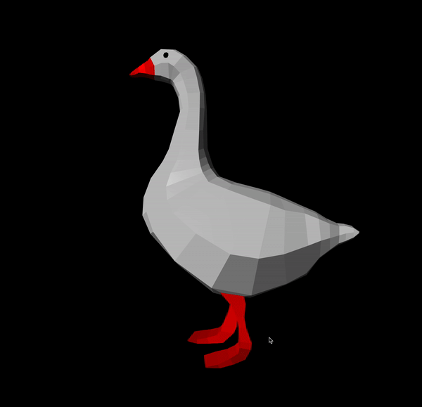
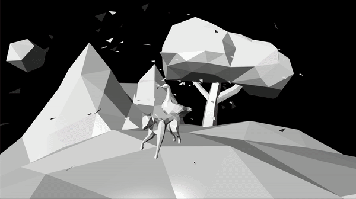
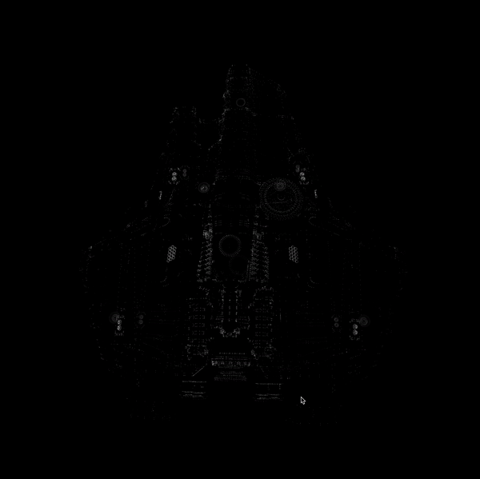

# Scop

#### Goals:
* L'objectif est de réaliser un programme qui affiche un objet 3D conçu au
moyen d’un logiciel de modélisation, comme Blender par exemple. L’objet 3D est stocké
dans un fichier au format .obj . Vous devez créer votre propre parser.
* Dans une fenêtre, votre objet 3D doit s’afficher, en perspective, en tournant sur lui-même autour de ce qui semble être son axe de symétrie principal. Par un jeu de couleur, il doit être possible de distinguer les différentes facettes. L’objet peut être déplacé sur les trois axes, dans les deux directions.
* Une texture doit pouvoir être appliquée basiquement sur l’objet lorsqu’on appuye sur une touche dédiée, et la même touche permet de revenir à l’affichage des couleurs. Une transition douce est demandée entre les deux.

#### Constraints:
* Coder en C
* Utiliser de l’OpenGL MODERNE : en version 4.0 minimum, avec des shaders obligatoirement.
* N’utiliser des librairies externes (autre qu’OpenGL, libm et la lib C) QUE pour la gestion de la fenêtre et des évènements. Pas de librairie pour loader l’objet 3D, ni pour vous faire les matrices, ou charger les shaders.

Regarder [subject.pdf](fr.subject.pdf) pour plus d'informations.

## Requirements:
* `c`
* `opengl`
* `gl3w`
* `glfw`

## Setup:
```
git clone https://github.com/LudovicLemaire/Scop-42.git
cd Scop-42
make
```

## Bonus:
#### Lights:
* Ambient light
* Directionnal light
* Specular light
### MTL:
* Get materials from MTL file (only kd for texture, not images)
### Normals/Texture:
* Get vertex normal (vn) from obj and apply them
* Get vertex texture (vt) from obj and apply them
* Calculate my own vt/vn if the file doesn't have it
### Rendering modes:
* Fill
* Wireframe
* Point
### Noise
* Noise mode from Gelfond–Schneider constant
### Multifaces:
* Work up to 5 vertex for one face (it will triangulate)
### Auto rescale/recenter
* Calculate during parsing to put the object at center, and resize it to be correctly visible

## Examples:

|./scop obj/[goose.obj](obj/goose.obj)|(not available on github due to file size)                      |
|-------------------------------------|----------------------------------------------------------------|
|              |                                         |
|Simple goose with texture from MTL   |Untextured Orion ship from Star Citizen, has 1.083.478 triangles|

|./scop obj/[fox.obj](obj/fox.obj)       |
|----------------------------------------|
|                   |
|Transition between whitebox and textured|

|Filled                                  |Wireframe                               |Points                                  |
|----------------------------------------|----------------------------------------|----------------------------------------|
|                  |             |                 |
|                                        |                                        |                                        |

|./scop obj/[castle.obj](obj/castle.obj)|
|---------------------------------------|
|              |
|Texture image applied on the obj       |


## Keys
#### Rotation:
- 7, 9, 4, 6, 8, 5 (kp)
#### Translation:
- wasd
#### Display modes:
- 1 to Fill
- 2 to Wireframe
- 3 to Point (-, + to increase, reduce size of points)
#### Special modes (cumulative):
- T to apply texture from image (4 to use next image, * (kp) to change texture point mode)
- B to get black and white triangles
- C to get random colored triangles
- N to get noised mode
#### Others:
- R epileptic mode (be carefull)
- LShift to boost rotation/translation speed
- +, - (kp) to increase, reduce speed of rotation/translation
- 1, 2, 3 (kp) to modify ambient light (1 is red, 2 is green, 3 is blue)